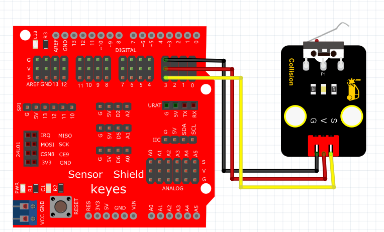

# Arduino


## 1. Arduino简介  

Arduino是一款开源的电子原型平台，包含硬件和软件。它易于使用，适合艺术家、设计师、爱好者和任何想要创造互动对象或环境的人。Arduino的硬件部分由微控制器构成，通常是ATmega系列芯片，它们能够执行不同的输入和输出操作。软件部分为Arduino IDE，提供了一种简洁的编程语言，基于C/C++，使得用户能够方便地编写、编译和上传代码。Arduino有丰富的资源和社区支持，用户可以利用各种传感器、模块和组件实现丰富的项目，如机器人、家居自动化、数据采集等。  

## 2. 连接图  

  

## 3. 测试代码  

```cpp  
int ledPin = 13; // 定义数字口13  
int inputPin = 3; // 定义数字口3  

void setup() {  
    pinMode(ledPin, OUTPUT); // 将ledPin设置为输出  
    pinMode(inputPin, INPUT); // 将inputPin设置为输入  
}  

void loop() {  
    int val = digitalRead(inputPin); // 设置数字变量val，读取到数字口3的数值，并赋值给 val  
    if (val == LOW) { // 当val为低电平时，LED亮起  
        digitalWrite(ledPin, HIGH); // LED亮起  
    } else {  
        digitalWrite(ledPin, LOW); // LED变暗  
    }  
}  
```  

## 4. 测试结果  

按照上图接好线，烧录好代码；上电后，将碰撞传感器的小铁片往下压，板上的D13的指示灯亮，同时碰撞模块上D1灯也亮。


