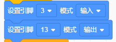

# KidsBlock

## 1. KidsBlock简介  

KidsBlock是一种图形化编程工具，旨在帮助儿童和编程初学者通过可视化界面轻松学习编程。它采用块状编程方式，用户可以通过拖放不同的编程模块来构建程序，而不需要编写复杂的代码。KidsBlock支持多种硬件平台，如Arduino，适用于制作各种有趣的项目和电子作品。通过使用KidsBlock，学生能够理解编程逻辑、控制流程和事件处理，同时培养他们的创造力和解决问题的能力。  

## 2. 连接图  

  

## 3. 测试代码  

1. 在事件栏拖出Arduino启动模块。  

     

2. 在引脚栏拖出两个设置引脚模式模块，一个设置为引脚3输入，另一个设置为引脚13输出。  

     

3. 在控制栏拖出重复执行模块。  

     

4. 在控制栏拖出判断模块，然后在判断模块里添加运算的等于模块，等于模块的左边添加读取数字引脚3模块，右边为0；满足条件时使第13引脚输出高电平，不满足时输出低电平。  

     

## 4. 测试结果  

按照上图接好线，烧录好代码；上电后，将碰撞传感器的小铁片往下压，板上的D13的指示灯亮，碰撞模块上的D1灯也亮起。

