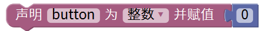
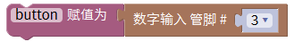
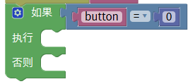
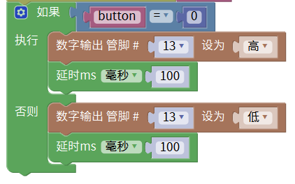

# Mixly

## 1. Mixly简介  

Mixly是一款易于使用的图形化编程工具，旨在帮助儿童和初学者通过可视化的界面学习编程。它采用模块化设计，允许用户通过拖放模块来创建程序，而不需要深入了解编程语言的复杂语法。Mixly支持多种硬件设备，包括Arduino，提供用于各种项目的丰富模块和功能。用户可以通过Mixly进行机器人控制、传感器项目和其他电子制作，这有助于领域中的创造性思维和实践能力的培养。其友好的用户界面和直观的操作方式，使学习编程变得轻松和有趣。  

## 2. 连接图  

  

## 3. 测试代码  

1. 在变量栏找到声明全局变量模块，将item变量名改为“button”，这里修改变量名是方便我们理解与记忆。设置button初始变量为整数，并赋值为0。  

     

2. 初始化设置波特率为9600，波特率是串口通信传输的一个速度量，这里表示9600bit每秒。  

     

3. 我们在变量栏里拖出button赋值模块，然后在输入/输出栏拖出数字引脚输入模块，设置引脚为3。  

     

4. 找到并拖出串口栏下的打印并自动换行模块，然后在变量下找到我们定义的变量button，放在打印模块后面。  

     

5. 在控制栏拖出判断模块并点击模块上的设置图案，多设置一个否则。  

     

6. 在逻辑栏拖出一个等于模块，然后在里面添加变量button和数字0。  

     

7. 在输入/输出栏拖出设置引脚模块，设置引脚为13，高电平，最后在控制栏拖出一个延时模块，延时为100ms。  

     

8. 在输入/输出栏拖出设置引脚模块，设置引脚为13，低电平，最后在控制栏拖出一个延时模块，延时为100ms。  

     

## 4. 测试结果  

按照上图接好线，烧录好代码；上电后，将碰撞传感器的小铁片往下压，板上的D13的指示灯亮，同时碰撞模块上的D1灯也亮起。

