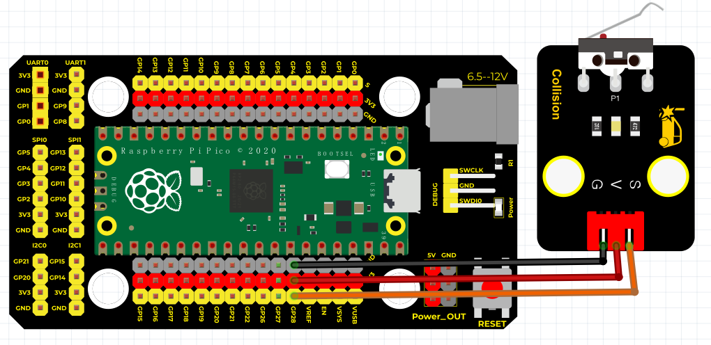

# Python


## 1. Python简介  

Python是一种通用的高级编程语言，以其简单易读的语法和强大的功能而闻名。它被广泛用于数据分析、机器学习、Web开发、自动化脚本、科学计算以及嵌入式系统开发等多个领域。Python的设计哲学强调代码的可读性，支持多种编程范式，包括面向对象、命令式和函数式编程。由于拥有丰富的标准库和第三方库，开发者可以轻松地处理各种复杂任务。从教学到生产，Python都深受开发者和数据科学家的喜爱。在物联网和嵌入式系统上，Python同样发挥着重要作用，尤其是在Arduino和ESP等热门平台上，结合MicroPython等轻量级实现，使得它在硬件项目中的应用非常广泛。  

## 2. 连接图  

  

## 3. 测试代码  

```python  
import machine  
import utime  

sensorPin = machine.Pin(28, machine.Pin.IN)  # 设置碰撞传感器引脚为28脚输入  
led = machine.Pin(25, machine.Pin.OUT)  # 设置led灯为25脚输出  

while True:  
    if sensorPin.value() == 0:  # 判断传感器输入的状态是否为0  
        led.value(1)  # 是led灯亮  
    else:  
        led.value(0)  # 不是led灯灭  
```  

## 4. 测试结果  

按照上图接好线，烧录好代码；上电后，将碰撞传感器的小铁片往下压，板上的指示灯亮，同时碰撞模块上的D1灯也亮起。


